

I am currently a fourth-year Ph.D. student under the supervision of Prof. <a href="https://yanweifu.github.io/">Yanwei Fu</a>. 
My research interests focus on the perception and anticipation of motion, especially optical flow estimation and future prediction. Besides, I am also interested in image generation, e.g., image inpainting/editing. Currently, I am also working on multimodal large language models.

Education

    

        

            
            

                

                    Ph.D in Statistics (Machine Learning track)
                    Fudan University
                

            

        

        2022.9-2026.6
    

    

        

            
            

                

                    B.Sc. in Data Science
                    Fudan University
                

            

        

        2018.9-2022.6
    

Services

    

        •
        Reviewer of CVPR, ICCV, ECCV, AAAI, ACCV, IJCV, IEEE TPAMI, IEEE TCSVT, IEEE TIP, IEEE TMM
    

Publications

* indicates equal contributions.

Multimodal Large Lanuage Models:

    

        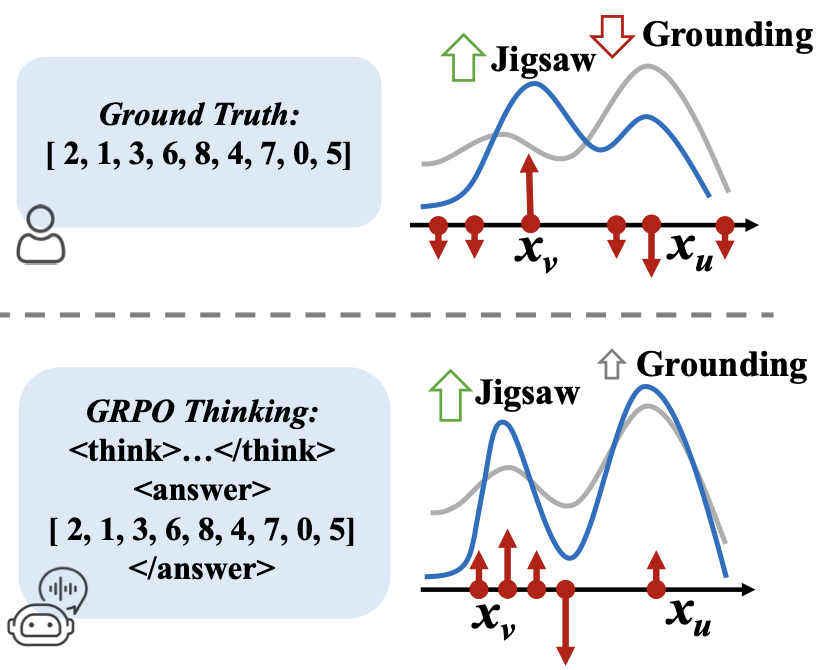
    

    

        <h3 class="publication-title">Reinforcement Fine-Tuning Enables MLLMs Learning Novel Tasks Stably</h3>
        
Zhihao Zhang*, <b>Qiaole Dong*</b>, Qi Zhang, ..., Xuanjing Huang

        

            

                <a href="https://arxiv.org/abs/2506.23508">Paper</a>
            

            

                Arxiv 2025
            

        

    

    

        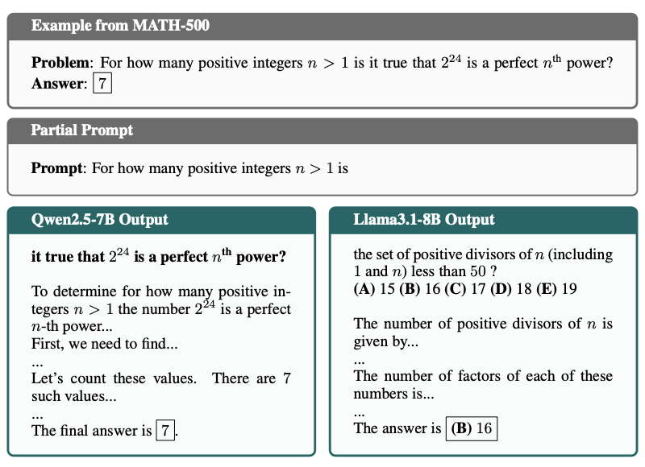
    

    

        <h3 class="publication-title">Reasoning or Memorization? Unreliable Results of Reinforcement Learning Due to Data Contamination</h3>
        
Mingqi Wu*, Zhihao Zhang*, <b>Qiaole Dong*</b>, Qi Zhang, et al.

        

            

                <a href="https://arxiv.org/abs/2507.10532">Paper</a>
            

            

                Arxiv 2025
            

        

    

Visual Perception:

    

        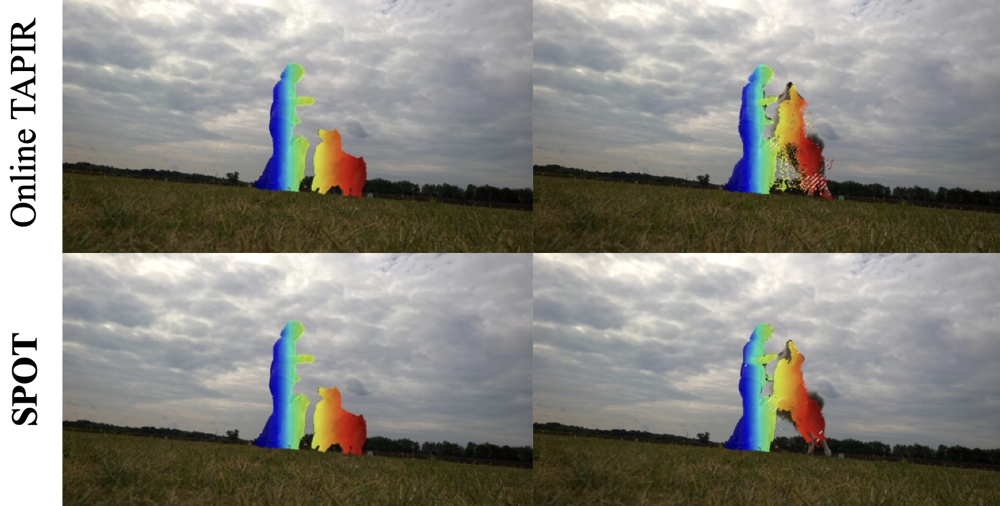
    

    

        <h3 class="publication-title">Online Dense Point Tracking with Streaming Memory</h3>
        
<b>Qiaole Dong</b>, Yanwei Fu

        

            

                <a href="https://arxiv.org/abs/2503.06471">Paper</a><a href="https://github.com/DQiaole/SPOT">Code</a><a href="https://dqiaole.github.io/SPOT/">Project</a>
            

            

                ICCV 2025
            

        

    

    

        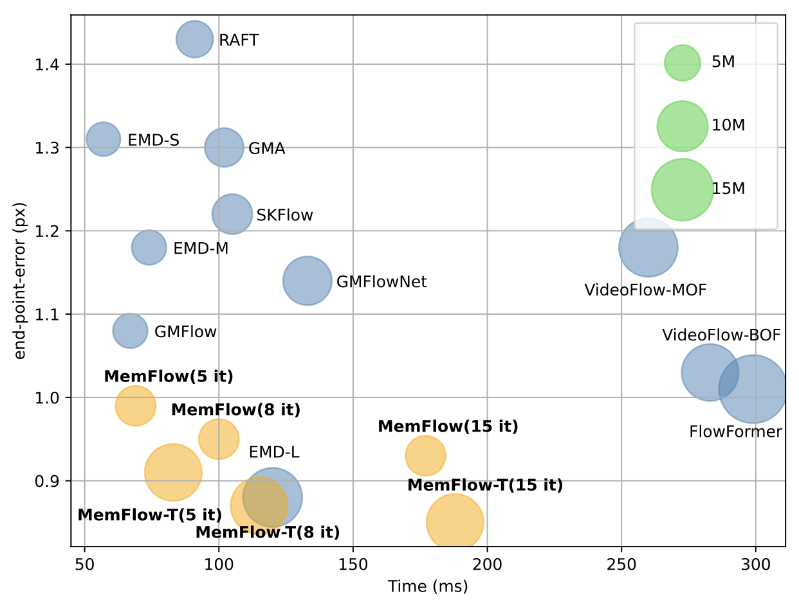
    

    

        <h3 class="publication-title">MemFlow: Optical Flow Estimation and Prediction with Memory</h3>
        
<b>Qiaole Dong</b>, Yanwei Fu

        

            

                <a href="https://arxiv.org/abs/2404.04808">Paper</a><a href="https://github.com/DQiaole/MemFlow">Code</a><a href="https://dqiaole.github.io/MemFlow/">Project</a>
            

            

                CVPR 2024
            

        

    

    

        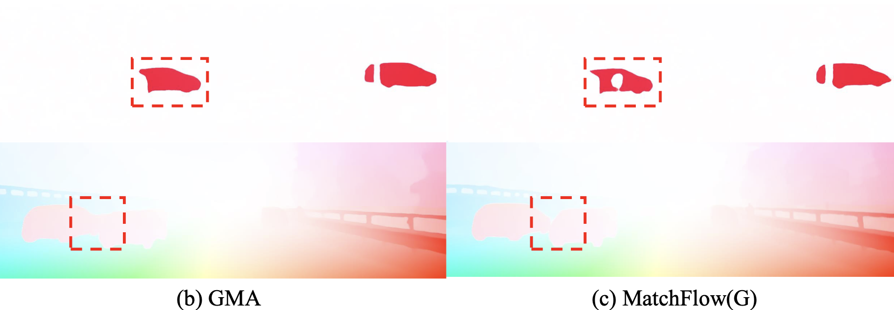
    

    

        <h3 class="publication-title">Rethinking Optical Flow from Geometric Matching Consistent Perspective</h3>
        
<b>Qiaole Dong*</b>, Chenjie Cao*, Yanwei Fu

        

            

                <a href="https://arxiv.org/abs/2303.08384">Paper</a>
                <a href="https://github.com/DQiaole/MatchFlow">Code</a><a href="https://dqiaole.github.io/MatchFlow/">Project</a>
            

            

                CVPR 2023
            

        

    

    

        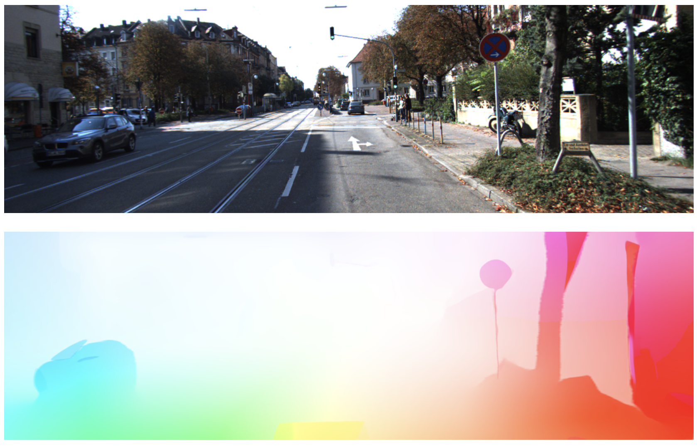
    

    

        <h3 class="publication-title">Open-DDVM: A Reproduction and Extension of Diffusion Model for Optical Flow Estimation</h3>
        
<b>Qiaole Dong</b>, Bo Zhao, Yanwei Fu

        

            

                <a href="https://arxiv.org/abs/2312.01746">Paper</a>
                <a href="https://github.com/DQiaole/FlowDiffusion_pytorch">Code</a>
            

            

                Arxiv 2023
            

        

    

Visual Generation:

    

        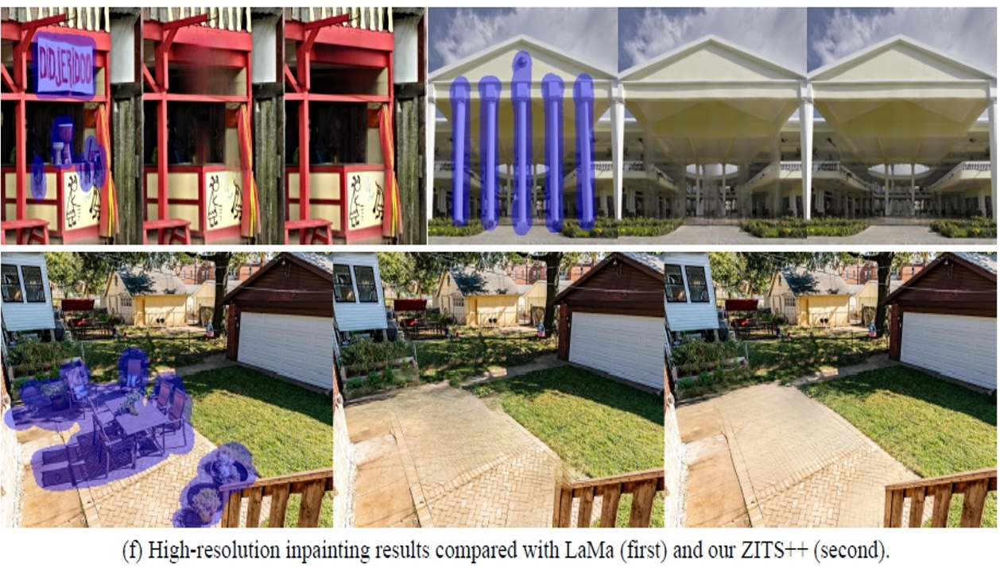
    

    

        <h3 class="publication-title">ZITS++: Image Inpainting by Improving the Incremental Transformer on Structural Priors</h3>
        
Chenjie Cao*, <b>Qiaole Dong*</b>, Yanwei Fu

        

            

                <a href="https://arxiv.org/abs/2210.05950">Paper</a>
                <a href="https://github.com/ewrfcas/ZITS-PlusPlus">Code</a><a href="https://ewrfcas.github.io/ZITS-PlusPlus/">Project</a>
            

            

                IEEE TPAMI 2023
            

        

    

    

        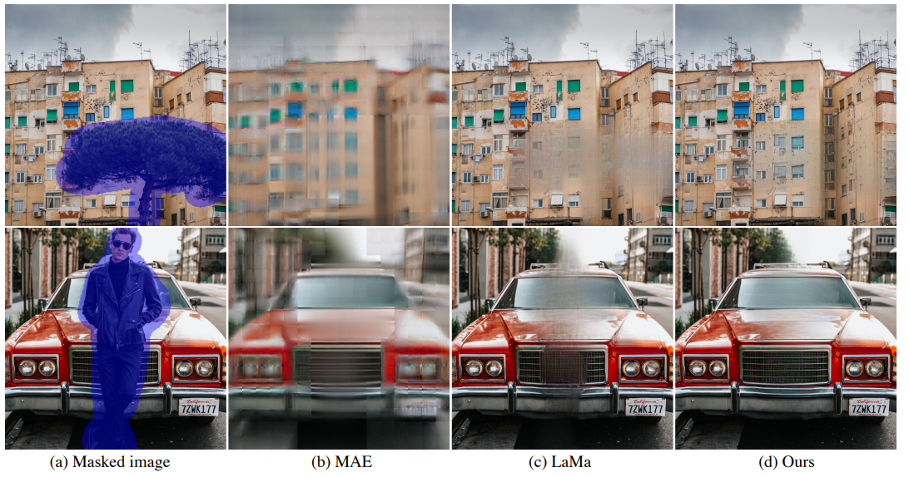
    

    

        <h3 class="publication-title">Learning Prior Feature and Attention Enhanced Image Inpainting</h3>
        
Chenjie Cao*, <b>Qiaole Dong*</b>, Yanwei Fu

        

            

                <a href="https://arxiv.org/abs/2208.01837.pdf">Paper</a>
                <a href="https://github.com/ewrfcas/MAE-FAR">Code</a><a href="https://ewrfcas.github.io/MAE-FAR/">Project</a>
            

            

                ECCV 2022
            

        

    

    

        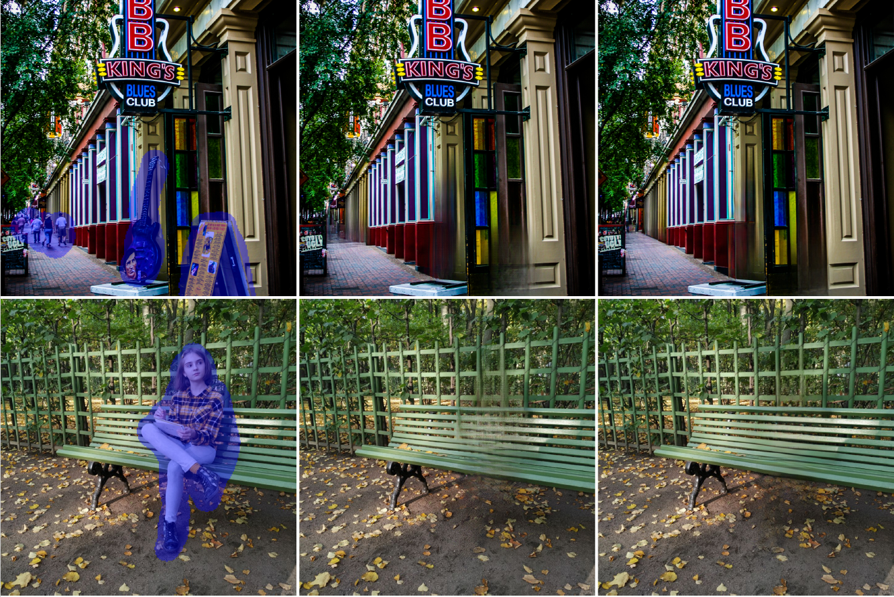
    

    

        <h3 class="publication-title">Incremental Transformer Structure Enhanced Image Inpainting with Masking Positional Encoding</h3>
        
<b>Qiaole Dong*</b>, Chenjie Cao*, Yanwei Fu

        

            

                <a href="https://openaccess.thecvf.com/content/CVPR2022/papers/Dong_Incremental_Transformer_Structure_Enhanced_Image_Inpainting_With_Masking_Positional_Encoding_CVPR_2022_paper.pdf">Paper</a>
                <a href="https://github.com/DQiaole/ZITS_inpainting">Code</a><a href="https://dqiaole.github.io/ZITS_inpainting/">Project</a>
            

            

                CVPR 2022
            

        

    

    

        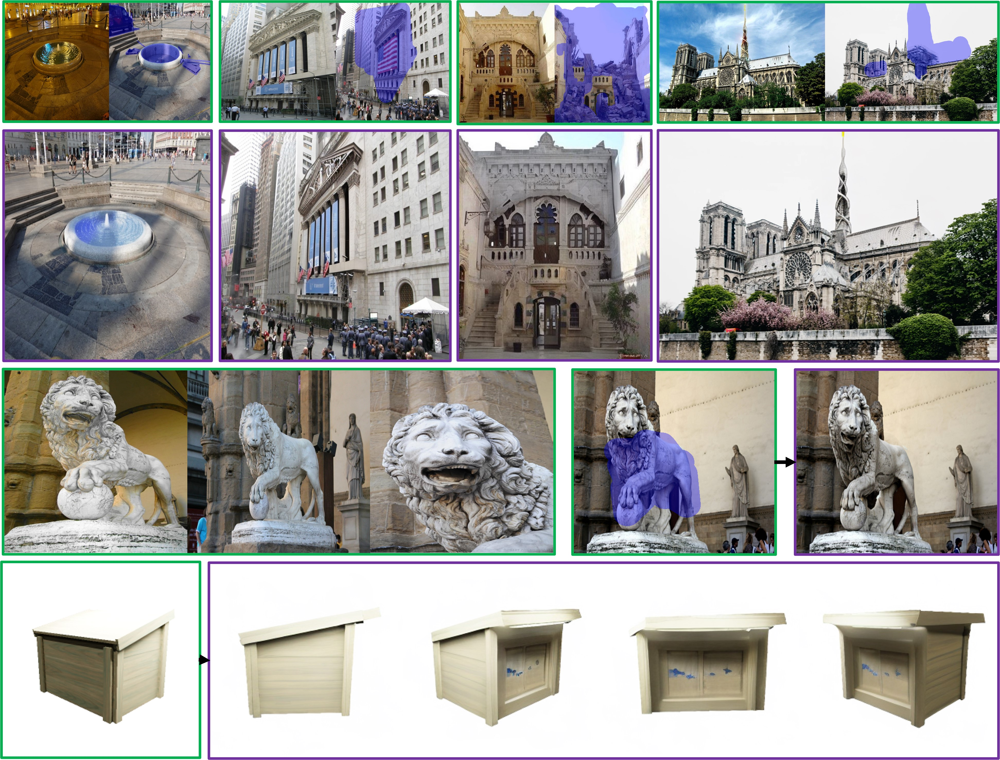
    

    

        <h3 class="publication-title">LeftRefill: Filling Right Canvas based on Left Reference through Generalized Text-to-Image Diffusion Model</h3>
        
Chenjie Cao, Yunuo Cai, <b>Qiaole Dong</b>, Yikai Wang, Yanwei Fu

        

            

                <a href="https://arxiv.org/abs/2305.11577">Paper</a>
                <a href="https://github.com/ewrfcas/LeftRefill">Code</a><a href="https://ewrfcas.github.io/LeftRefill/">Project</a>
            

            

                CVPR 2024
            

        

    

    

        
    

    

        <h3 class="publication-title">Repositioning the Subject
within Image</h3>
        
Yikai Wang, Chenjie Cao, Ke Fan, <b>Qiaole Dong</b>, Yifan Li, Xiangyang Xue, Yanwei Fu

        

            

                <a href="https://openreview.net/pdf?id=orHH4fCtR8">Paper</a><a href="https://yikai-wang.github.io/seele/">Project</a>
            

            

                TMLR 2024
            

        

    

Others:

    

        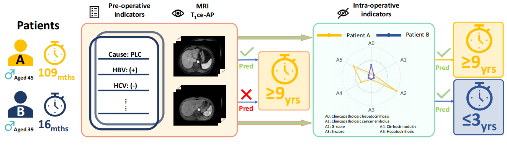
    

    

        <h3 class="publication-title">Causally-Aware Intraoperative Imputation for Overall Survival Time Prediction</h3>
        
Xiang Li*, Xuelin Qian*, Litian Liang*, Lingjie Kong, <b>Qiaole Dong</b>, ..., Yanwei Fu

        

            

                <a href="https://openaccess.thecvf.com/content/CVPR2023/papers/Li_Causally-Aware_Intraoperative_Imputation_for_Overall_Survival_Time_Prediction_CVPR_2023_paper.pdf">Paper</a><a href="https://github.com/ChrisXLi/CaDAG">Code</a>
            

            

                CVPR 2023
            

        

    

